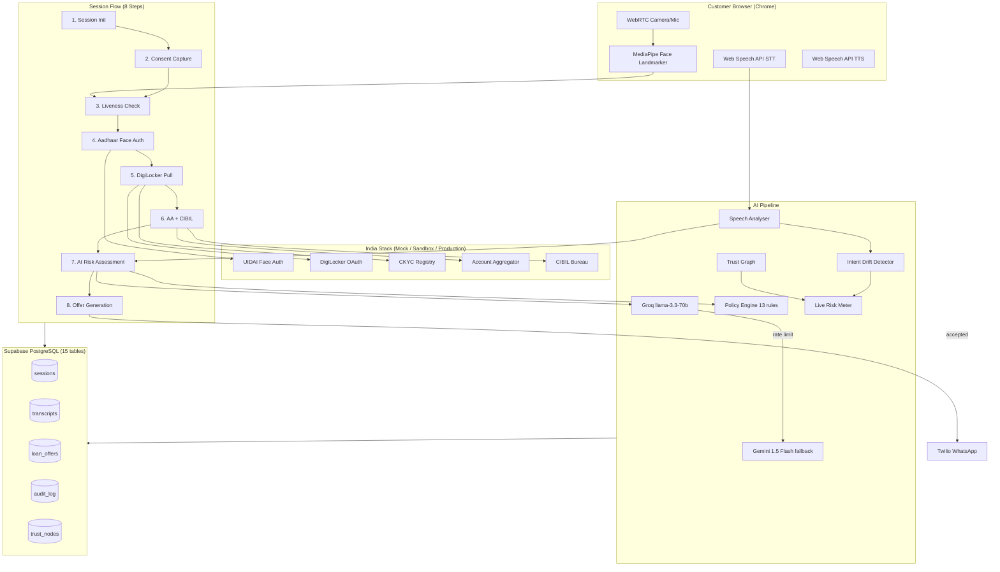
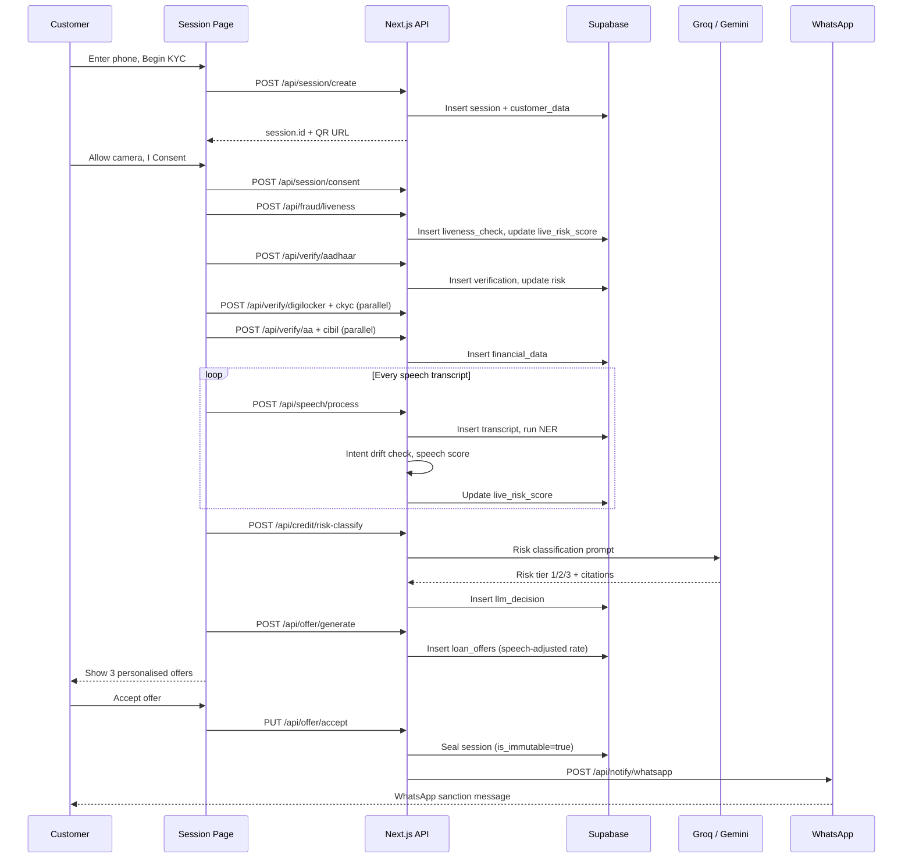

# VERITAS — Agentic V-CIP Platform

> **AI-powered Video KYC & Instant Loan Onboarding** by Poonawalla Fincorp.
> Identity verified, documents pulled, credit assessed, offer generated — in a single 8-minute live video call. Zero paperwork.

[](https://nextjs.org)
[](https://typescriptlang.org)
[](https://supabase.com)
[](https://vercel.com)
[](.)
[](.)

**Live:** [veritas-theta.vercel.app](https://veritas-theta.vercel.app/)

---

## Architecture

> Full architecture diagrams available in [`docs/`](./docs/) — open `.drawio` files in [app.diagrams.net](https://app.diagrams.net/) or VS Code draw.io extension.

| Diagram | Description |
|---------|-------------|
| [`architecture-diagram.drawio`](./docs/architecture-diagram.drawio) | System-level: Client, Vercel, AI, India Stack, Supabase, Twilio |
| [`block-diagram.drawio`](./docs/block-diagram.drawio) | Internal modules: Frontend, 26 API Routes, Core Logic, Security |
| [`database-er-diagram.drawio`](./docs/database-er-diagram.drawio) | All 15 tables with columns, types, PK/FK, encrypted fields |
| [`microservice-architecture-diagram.drawio`](./docs/microservice-architecture-diagram.drawio) | 6 bounded contexts + cross-cutting concerns + patterns |



---

## Request Flow



---

## Features

### Core KYC Pipeline
- **Real video call** — WebRTC `getUserMedia`, browser-native, no plugins
- **Continuous speech recognition** — Web Speech API, NER extracts loan amount / income / employer mid-conversation
- **Contextual question prompts** — overlaid on video at each step, feed into transcript analysis
- **Agent TTS** — responds in Indian English via Web Speech Synthesis
- **India Stack abstraction** — Factory pattern supporting mock/sandbox/production via `INDIA_STACK_MODE` env:
  - Even last digit → **Rahul** (freelancer, CIBIL 680, Tier 2 risk)
  - Odd last digit → **Priya** (TCS employee, CIBIL 762, Tier 1 risk)

### Fraud & Risk Intelligence
| Feature | Details |
|---|---|
| Live Risk Meter | Real-time 0-100 score, 15 event types, circular gauge with pulse animation |
| Liveness Detection | MediaPipe Face Landmarker, blink EAR + nose-tip micro-movement variance |
| Spoof Check | GAN confidence score, triggers re-verification overlay |
| Intent Drift | Rule-based (income/employer/name) + LLM semantic contradiction analysis |
| Trust Graph | Cross-session PAN/phone/Aadhaar reuse detection, fraud ring clustering |
| Speech Analysis | Hesitation markers, evasion patterns → 0-300 bps interest rate adjustment |

### AI Pipeline
| Component | Details |
|---|---|
| LLM | Groq llama-3.3-70b → Gemini 1.5 Flash (auto-fallback on 429) |
| Policy Engine | 13 hard rules (age floor, CIBIL floor, FOIR cap) — LLM cannot override |
| Digital Trust Score | 5-dimension AA transaction composite |
| Shadow NLP Score | LLM grades conversation quality as soft credit signal |
| Offer Negotiation | AI chat interface re-calculates EMI from natural language requests |

### Security & Compliance (L4)
| Feature | Details |
|---|---|
| Encryption | AES-256-GCM on all PII fields (full_name, aadhaar_last4, pan, dob, address) |
| Validation | Zod schemas on all 26 API routes |
| Rate Limiting | Token bucket per endpoint (5-100 req/min) via Next.js 16 `proxy.ts` |
| Prompt Sanitization | LLM input sanitized against injection attacks |
| Security Headers | CSP, HSTS, X-Frame-Options, X-Content-Type-Options |
| Session Recording | MediaRecorder VP9/Opus, 30s chunks → Supabase Storage, SHA-256 hashed |
| Geolocation | Browser GPS + India boundary verification + VPN detection |
| Hash Chain Audit | SHA-256 chained events, PMLA Section 12 compliant, immutable after seal |

### UX & Auth
- **Dual-path home page** — customer KYC flow + agent dashboard portal
- **Google Sign-In** — Supabase OAuth, `/auth/callback` route
- **QR code handoff** — scan to continue session on mobile
- **Light / dark mode** — CSS variable theming, persisted to localStorage
- **Gamification** — XP rewards at each step, particle burst celebrations
- **WhatsApp notification** — Twilio API, sanction details sent on offer acceptance
- **REC indicator** — RBI V-CIP Section 3.1 session recording badge during video call
- **User-controlled steps** — "Continue →" button between steps (no auto-advance)

---

## Tech Stack

| Layer | Choice |
|---|---|
| Framework | Next.js 16, App Router, TypeScript 5 |
| Styling | Tailwind CSS v4, Framer Motion |
| Video | WebRTC (`getUserMedia`) |
| Face Detection | MediaPipe Face Landmarker (WASM, CPU delegate) |
| Speech | Web Speech API (STT + TTS, browser-native) |
| LLM | Groq llama-3.3-70b → Gemini 1.5 Flash |
| Database | Supabase (PostgreSQL + RLS + Realtime), 15 tables |
| Auth | Supabase OAuth (Google) |
| Notifications | Twilio WhatsApp Business API |
| State | Zustand |
| Encryption | AES-256-GCM (Node.js crypto) |
| Validation | Zod |
| Testing | Vitest (83 tests, 80%+ coverage) |
| Deploy | Vercel |

---

## Database Schema (15 Tables)

> Full ER diagram with all columns: [`docs/database-er-diagram.drawio`](./docs/database-er-diagram.drawio)

| Table | Color | Purpose |
|-------|-------|---------|
| `sessions` | Purple | Session lifecycle, risk score, geo, device |
| `customer_data` | Red | PII (🔒 encrypted: name, aadhaar, pan, dob, address) |
| `consents` | Purple | Verbal/written consent with audio hash |
| `verifications` | Green | India Stack provider responses (5 providers) |
| `fraud_events` | Orange | Detected fraud with confidence + action taken |
| `liveness_checks` | Orange | Blink count, micro-movement, head pose, confidence |
| `financial_data` | Green | CIBIL, AA data, digital trust, shadow NLP scores |
| `transcripts` | Purple | Speech-to-text with NER entities extracted |
| `llm_decisions` | Orange | Risk tier, reasoning, RBI citations |
| `loan_offers` | Amber | Amount, rate, tenure, EMI, acceptance status |
| `audit_log` | Orange | SHA-256 hash-chained event log (tamper-evident) |
| `recordings` | Purple | Session recording metadata, composite hash |
| `recording_chunks` | Purple | 30s VP9 chunks in Supabase Storage |
| `trust_nodes` | Blue | Graph nodes (phone, PAN, Aadhaar, email) |
| `trust_edges` | Blue | Graph edges linking nodes across sessions |

---

## Setup

### 1. Clone and install

```bash
git clone https://github.com/ayushmgarg/Veritas-Poonawalla-Fincorp.git
cd Veritas-Poonawalla-Fincorp
npm install
```

### 2. Environment variables

```bash
cp .env.example .env.local
```

| Variable | Source | Required |
|---|---|---|
| `NEXT_PUBLIC_SUPABASE_URL` | Supabase → Settings → API | Yes |
| `NEXT_PUBLIC_SUPABASE_ANON_KEY` | Same page | Yes |
| `SUPABASE_SERVICE_ROLE_KEY` | Same page (keep secret) | Yes |
| `GROQ_API_KEY` | [console.groq.com](https://console.groq.com) (free) | Yes |
| `GEMINI_API_KEY` | [aistudio.google.com/apikey](https://aistudio.google.com/apikey) (free) | Fallback |
| `ENCRYPTION_KEY` | 32-byte hex string for AES-256-GCM | Yes |
| `SESSION_SECRET` | Random string for HMAC session tokens | Yes |
| `INDIA_STACK_MODE` | `mock` / `sandbox` / `production` | Default: `mock` |
| `TWILIO_ACCOUNT_SID` | [twilio.com/console](https://twilio.com/console) | WhatsApp |
| `TWILIO_AUTH_TOKEN` | Same page | WhatsApp |
| `TWILIO_WHATSAPP_FROM` | Sandbox: `whatsapp:+14155238886` | WhatsApp |
| `NEXT_PUBLIC_APP_URL` | Your domain (e.g. `https://veritas-theta.vercel.app`) | Production |

### 3. Database

Supabase → SQL Editor → paste `supabase-schema.sql` → Run.

> **Existing DB?** Uncomment the migration block at the bottom of `supabase-schema.sql` and run only that section.

Additional manual steps:
- `ALTER TABLE customer_data ALTER COLUMN dob TYPE TEXT;` (required for encrypted dob)
- Create Storage bucket: `vcip-recordings` (private, 50MB max)

### 4. Google Sign-In (optional)

1. [Google Cloud Console](https://console.cloud.google.com) → Credentials → OAuth 2.0 Client ID (Web)
2. Authorized redirect URI: `https://<supabase-ref>.supabase.co/auth/v1/callback`
3. Supabase → Authentication → Providers → Google → paste Client ID + Secret

### 5. Twilio WhatsApp Sandbox

1. [twilio.com/console/sms/whatsapp/sandbox](https://twilio.com/console/sms/whatsapp/sandbox)
2. Send `join <your-word>` from your WhatsApp to `+1-415-523-8886`
3. Copy Account SID + Auth Token into `.env.local`

> For production: upgrade to a Twilio WhatsApp Business sender (requires Meta approval).

### 6. Run locally

```bash
npm run dev
```

Open `http://localhost:3000` in **Chrome** — required for Web Speech API.

### 7. Run tests

```bash
npm test          # Run all 83 tests
npm run test:ui   # Vitest UI
```

---

## Project Structure

```
src/
  app/
    page.tsx              Home page (dual-path: customer + agent)
    api/
      session/            Session CRUD, step, consent, risk, stream
      verify/             Aadhaar, DigiLocker, CKYC, CIBIL, AA
      fraud/              Liveness, spoof-check, trust-graph, intent-drift
      credit/             Shadow score, risk classification, digital trust
      offer/              Generate, negotiate, accept
      speech/             Transcript processing + NER
      notify/             WhatsApp notification
      recording/          Upload chunks, seal recording
      geo/                Geolocation verification
      audit/              Audit log retrieval
    session/[id]/         Customer video call + offer page
    dashboard/            Agent monitoring (PIN: VERITAS)
    audit/[sessionId]/    Hash chain audit trail
    auth/callback/        Supabase OAuth
  components/
    session/              AgentPanel, LiveRiskMeter, QuestionPrompt,
                          ConsentModal, DigiLockerModal, FraudAlertOverlay,
                          LivenessIndicator, StepProgress, TranscriptPanel,
                          XPCelebration, OfferCard
    dashboard/            EventTimeline, FinancialSummary, FraudGauges,
                          IndiaStackChecklist, LLMReasoningPanel, SessionCard
    ui/                   ThemeToggle, GoogleSignIn, QRCode, Modal, Badge
  hooks/                  useWebRTC, useFaceDetection, useLiveness,
                          useSpeechRecognition, useMediaRecorder,
                          useGeolocation, useSession, useSSE
  lib/
    llm.ts                Groq + Gemini router with fallback
    supabase.ts           Supabase client (browser + server)
    policy-engine.ts      13 hard rules (deterministic)
    risk-engine.ts        Live risk scoring (15 event types)
    offer-calculator.ts   EMI math + speech-adjusted rates
    speech-analysis.ts    Hesitation/evasion scoring
    intent-drift.ts       Contradiction detection
    digital-trust.ts      5-dimension AA composite
    trust-graph.ts        Cross-session fraud network
    hash-chain.ts         SHA-256 chained audit trail
    encryption.ts         AES-256-GCM encrypt/decrypt
    rate-limiter.ts       Token bucket with endpoint presets
    sanitizer.ts          LLM prompt injection prevention
    geo-verifier.ts       India boundary + VPN detection
    validation/           Zod schemas for all 26 routes
    india-stack/          Factory + mock/sandbox/production providers
    __tests__/            6 test suites (83 tests)
  constants/              steps, prompts, policy-rules
  types/                  TypeScript interfaces
  proxy.ts                Next.js 16 proxy (rate limiting + headers)
docs/
  architecture-diagram.drawio
  block-diagram.drawio
  database-er-diagram.drawio
  microservice-architecture-diagram.drawio
```

---

## Demo Flow

1. Open `/` → click **Apply for a Loan**
2. Enter any 10-digit number → **Begin KYC** (or Continue with Google)
3. Scan QR to continue on mobile, or **Continue here**
4. Allow camera + microphone
5. Consent modal → **I Consent**
6. Blink twice when prompted (liveness)
7. Speak your details — agent extracts income / employer / loan purpose
8. DigiLocker modal → **Authorize**
9. AI risk + speech assessment → 3 personalised offers
10. Accept → confetti + WhatsApp sanction message

**Try different personas:**
- `9999999990` (even) → Rahul, freelancer, CIBIL 680
- `9999999991` (odd) → Priya, TCS, CIBIL 762

**Fraud demo:** hold a photo to camera during liveness — spoof overlay fires, risk score spikes red.

**Agent view:** `/dashboard` (PIN: `VERITAS`)

**Audit trail:** `/audit/<session-id>`

---

## Deployment (Vercel)

### 1. Push to GitHub

```bash
git add .
git commit -m "feat: VERITAS agentic V-CIP platform"
git push origin main
```

### 2. Import on Vercel

1. [vercel.com/new](https://vercel.com/new) → Import Git Repository
2. Select your repo → Framework: **Next.js** (auto-detected)

### 3. Set environment variables

Vercel → Project → Settings → Environment Variables — add all vars from `.env.local`:

```
NEXT_PUBLIC_SUPABASE_URL
NEXT_PUBLIC_SUPABASE_ANON_KEY
SUPABASE_SERVICE_ROLE_KEY
GROQ_API_KEY
GEMINI_API_KEY
ENCRYPTION_KEY
SESSION_SECRET
INDIA_STACK_MODE=mock
TWILIO_ACCOUNT_SID
TWILIO_AUTH_TOKEN
TWILIO_WHATSAPP_FROM
NEXT_PUBLIC_APP_URL=https://veritas-theta.vercel.app
```

> Set `NEXT_PUBLIC_APP_URL` to your actual Vercel domain — it's used for internal API calls on offer accept.

### 4. Deploy

Click **Deploy**. Build takes ~60 seconds.

### 5. Post-deploy

- Update Google OAuth redirect URI to `https://your-domain.vercel.app` → callback
- Update `NEXT_PUBLIC_APP_URL` in Vercel env vars to match production URL
- Redeploy once after updating env vars (Vercel caches them at build time)

---

## Compliance

| Regulation | Coverage |
|---|---|
| RBI V-CIP Master Direction 2024 | Section 3.1 session recording, 5.1 verbal consent, 7.2 liveness, 9 offer generation |
| PMLA Section 12 | Tamper-evident SHA-256 hash chain, 10-year immutable WORM retention |
| DPDP Act 2023 Section 8 | Data minimisation, explicit consent before any processing |
| UIDAI KUA Section 4(e) | Face authentication via Aadhaar |
| CERT-In Guidelines | AES-256-GCM encryption for all PII at rest |

---

## Testing

- **83 tests** across 6 suites (Vitest)
- **80%+ coverage** thresholds enforced
- Core modules tested: policy-engine, risk-engine, offer-calculator, encryption, hash-chain, geo-verifier, sanitizer

```bash
npm test                 # Run all tests
npm run test:coverage    # With coverage report
```

---

## Current Status: L4 (Production-Grade Beta)

| Capability | Status |
|---|---|
| Video recording (MediaRecorder → upload → hash → seal) | Done |
| Geolocation (browser GPS + IP verification) | Done |
| AES-256-GCM encryption for all PII | Done |
| Zod validation on all 26 API routes | Done |
| Rate limiting on all endpoints | Done |
| LLM prompt injection prevention | Done |
| Security headers (CSP, HSTS, X-Frame-Options) | Done |
| Unit tests (83 tests, 80%+ coverage) | Done |
| India Stack abstraction (mock/sandbox/production) | Done |
| Environment variable validation | Done |
| Integration tests for API routes | Pending |
| E2E tests (Playwright) | Pending |
| Error monitoring (Sentry) | Pending |
| CI/CD pipeline (GitHub Actions) | Pending |
| Human-in-the-loop approval (RBI Section 18A) | Pending |
